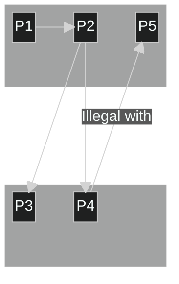
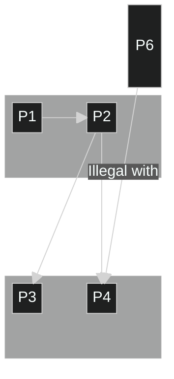
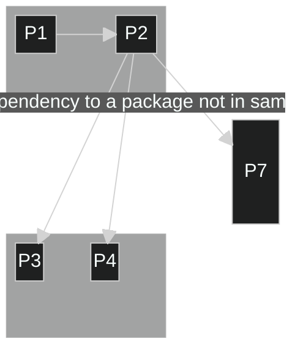

## Feature: Layer rules test suite

- [Feature: Layer rules test suite](#feature-layer-rules-test-suite)
  - [Scenario: Sanity test, the Batik project architecture](#scenario-sanity-test-the-batik-project-architecture)
  - [Scenario: Base normal situation](#scenario-base-normal-situation)
  - [Scenario: Illegal upward dependency](#scenario-illegal-upward-dependency)
  - [Scenario: Layer bridging](#scenario-layer-bridging)
  - [Scenario: Using a package that is neither in the same layer, nor in the visible layer](#scenario-using-a-package-that-is-neither-in-the-same-layer-nor-in-the-visible-layer)

### Scenario: Sanity test, the Batik project architecture

Given this (old) architecture diagram of the Apache Batik Project (available [here](https://xmlgraphics.apache.org/batik/using/architecture.html)).  

  

It is described by this rules file :  

- Given the file `rules.B`
```  
Applications      contains Browser and Rasterizer
Core_Modules      contains UI_Component, Transcoder, SVG_Generator, Bridge and SVGDOM
Low_Level_Modules contains Renderer, GVT and SVG_Parser

Applications is a layer over Core_Modules
Core_Modules is a layer over Low_Level_Modules
```  

This architecture is reproduced with Ada packages:
- When I run `./create_pkg Browser       spec -in dirB -with UI_Component`
- When I run `./create_pkg Rasterizer    spec -in dirB -with Transcoder`
- When I run `./create_pkg UI_Component  spec -in dirB -with Bridge -with Renderer`
- When I run `./create_pkg Transcoder    spec -in dirB -with Bridge -with Renderer`
- When I run `./create_pkg Bridge        spec -in dirB -with GVT -with SVGDOM`
- When I run `./create_pkg Renderer      spec -in dirB -with GVT`
- When I run `./create_pkg GVT           spec -in dirB`
- When I run `./create_pkg SVGDOM        spec -in dirB -with SVG_Parser`
- When I run `./create_pkg SVG_Parser    spec -in dirB`
- When I run `./create_pkg SVG_Generator spec -in dirB -with SVGDOM`
  
- When I run `./acc -q -I dirB rules.B`

Code is compliant with rules file, no output expected:  
- Then I get no output
- And  I get no error

### Scenario: Base normal situation

This scenario describe a basic situation, that raise no warning or error.
Following scenarios will be based on this one, adding anomal "with". 

- Given the file `rules.1`
```  
Layer_A contains P1, P2
Layer_B contains P3, P4
Layer_A is a layer over Layer_B
```  
Let's create the code in dir1, compliant with this description:

~~~mermaid
%%{init: {'theme':'dark'}}%%
block-beta
columns 3
  block:Layer_A:3
    P1 space P2
  end
  space:3
  block:Layer_B:3
    P3 space P4
  end

  P1 --> P2
  P2 --> P3
  P2 --> P4
~~~

- Given the `./dir1/` dir
  
- When I run `./create_pkg P1 spec  -in dir1 -with P2`
- When I run `./create_pkg P2 spec  -in dir1 -with P3`
- When I run `./create_pkg P2 body  -in dir1 -with P4`
- When I run `./create_pkg P3 spec  -in dir1`
- When I run `./create_pkg P4 spec  -in dir1`
  
- When I run `./acc -q -I dir1 rules.1` or `./acc --quiet -I dir1 rules.1`

Code being compliant with rules file, no output expected:  
- Then I get no output
- And  I get no error


### Scenario: Illegal upward dependency

Detection of a dependency from a lower layer component to an upper layer component.  



- Given the file `rules.2`
```  
Layer_A contains P1, P2, P5
Layer_B contains P3, P4
Layer_A is a layer over Layer_B
```  

- When I run `./create_pkg P1 spec  -in dir2 -with P2`
- When I run `./create_pkg P2 spec  -in dir2 -with P3 -with P4`
- When I run `./create_pkg P3 spec  -in dir2`
- When I run `./create_pkg P4 spec  -in dir2 -with P5`
- When I run `./create_pkg P5 spec  -in dir2`

- When I run `./acc --quiet -I dir2 rules.2`

- Then I get
```  
Error : dir2/p4.ads:1: P4 is in Layer_B layer, and so shall not use P5 in the upper Layer_A layer
```  

### Scenario: Layer bridging

Detection of a dependency to a lower layer crossing the upper layer.  



- Given the file `rules.3`
```  
Layer_A contains P1, P2
Layer_B contains P3, P4
Layer_A is a layer over Layer_B
```  
- When I run `./create_pkg P1 spec  -in dir3a -with P2`
- When I run `./create_pkg P2 spec  -in dir3a`
- When I run `./create_pkg P2 body  -in dir3a -with P3 -with P4`
- When I run `./create_pkg P3 spec  -in dir3b`
- When I run `./create_pkg P4 spec  -in dir3b`
- When I run `./create_pkg P6 spec  -in dir3c`
- When I run `./create_pkg P6 body  -in dir3c -with P4`

- When I run `./acc -I dir3a -I dir3b -I dir3c rules.3`

- Then I get
```  
Warning : dir3c/p6.adb:1: P6 is neither in Layer_A or Layer_B layer, and so shall not directly use P4 in the Layer_B layer
```  

### Scenario: Using a package that is neither in the same layer, nor in the visible layer

Detection of an un-described dependency to a component that is neither in the same layer, nor in the lower layer.  



- Given the file `rules.4`
```  
Layer_A contains P1, P2
Layer_B contains P3, P4
Layer_A is a layer over Layer_B
```  

- When I run `./create_pkg P1 spec  -in dir4 -with P2`
- When I run `./create_pkg P2 spec  -in dir4 -with P3 -with P4 -with P7`
- When I run `./create_pkg P3 spec  -in dir4`
- When I run `./create_pkg P4 spec  -in dir4`
- When I run `./create_pkg P7 spec  -in dir4`

- When I run `./acc -I dir4 rules.4`
  
- Then I get
```  
Warning : dir4/p2.ads:3: P2 (in Layer_A layer) uses P7 that is neither in the same layer, nor in the lower Layer_B layer
```  
