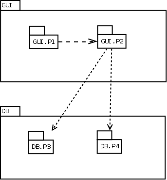
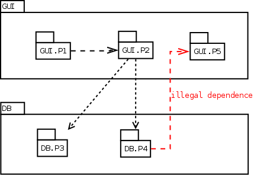
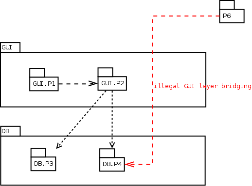
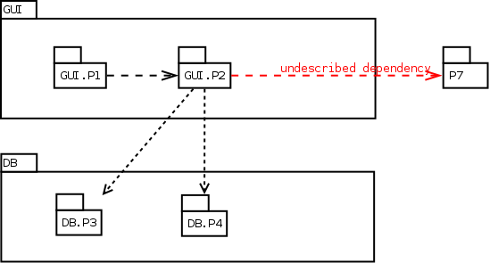

## Feature: Child packages test suite

The tests hereafter are similar to those in [Layer rules tests suite], except that child packages allows to simplify rules file.  

The file rules :  
```  
 GUI contains P1 and P2  
 DB  contains P3 and P4  
 GUI is a layer over DB  
```  

is simplified in :  

```  
GUI is a layer over DB
```  

and packages GUI.P1, GUI.P2, DB.P3 and DB.P4 are created.  

### Background 

- Given the file `rules.txt`
```  
GUI is a layer over DB
```  

### Scenario: Rules OK test, no output expected

  

- When I run `./create_pkg GuI.P1 spec  -in dir1 -with GUI.P2`
- When I run `./create_pkg GUI.P2 spec  -in dir1 -with DB.p3 -with DB.P4`
- When I run `./create_pkg Db.P3  spec  -in dir1`
- When I run `./create_pkg DB.P4  spec  -in dir1`

- When I run `./acc -q -I dir1 rules.txt`
- Then I get no error
- And  I get no output

### Scenario: Reverse dependency test

Detection of a dependency from a lower layer component to an upper layer component.  
  

- When I run `./create_pkg GUI.P1 spec  -in dir2 -with GUI.P2`
- When I run `./create_pkg GUI.P2 spec  -in dir2 -with DB.P3 -with DB.P4`
- When I run `./create_pkg DB.P3  spec  -in dir2`
- When I run `./create_pkg DB.P4  spec  -in dir2`
- When I run `./create_pkg DB.P4  body  -in dir2 -with GUI.P5`
- When I run `./create_pkg GUI.P5 spec  -in dir2`

- When I run `./acc -q -I dir2 rules.txt`
 
- Then I get
```  
Error : dir2/db-p4.adb:1: DB.P4 is in DB layer, and so shall not use GUI.P5 in the upper GUI layer
```  

### Scenario: Layer bridging test

Detection of a dependency link crossing a layer.  
  

- When I run `./create_pkg GUI.P1 spec  -in dir3 -with GUI.P2`
- When I run `./create_pkg GUI.P2 spec  -in dir3 -with DB.P3 -with DB.P4`
- When I run `./create_pkg DB.P3  spec  -in dir3`
- When I run `./create_pkg DB.P4  spec  -in dir3`
- When I run `./create_pkg P6     spec  -in dir3 -with DB.P4`

- When I run `./acc -I dir3 rules.txt`

- Then I get
```  
Warning : dir3/p6.ads:1: P6 is neither in GUI or DB layer, and so shall not directly use DB.P4 in the DB layer
```  

### Scenario: Undescribed dependency test

Detection of an undescribed dependency to a component that is neither in the same layer, nor in the lower layer.  

  

- When I run `./create_pkg GUI.P1 spec  -in dir4 -with GUI.P2`
- When I run `./create_pkg GUI.P2 spec  -in dir4 -with DB.P3 -with DB.P4 -with P7`
- When I run `./create_pkg DB.P3  spec  -in dir4`
- When I run `./create_pkg DB.P4  spec  -in dir4`
- When I run `./create_pkg P7     spec  -in dir4`

- When I run `./acc -I dir4 rules.txt`

- Then I get
```  
Warning : dir4/gui-p2.ads:3: GUI.P2 (in GUI layer) uses P7 that is neither in the same layer, nor in the lower DB layer
```  

### Scenario: Packages in the same layer may with them self

- When I run `./create_pkg GUI.P1 spec  -in dir5`
- When I run `./create_pkg GUI.P2 spec  -in dir5 -with GUI.P1`
- When I run `./create_pkg DB.P3  spec  -in dir5`
- When I run `./create_pkg DB.P4  spec  -in dir5 -with DB.P3`

- When I run `./acc -I dir5 rules.txt`
Interfaces   use is forbidden
Interfaces.C use is allowed

- Then I get no error
- And  I get no output
  
### Scenario: GUI.P1 is a GUI child, GUIP1 is not a GUI child pkg

- When I run `./create_pkg GUI.P1 spec  -in dir6 -with DB.P1`
- When I run `./create_pkg GUIP2  spec  -in dir6 -with DB.P1`
- When I run `./create_pkg DB.P1  spec  -in dir6`
- When I run `./create_pkg DBP2   spec  -in dir6 -with DB.P1`

- When I run `./acc -I dir6 rules.txt`
 
- Then I get (unordered)
```  
Warning : dir6/dbp2.ads:1: DBP2 is neither in GUI or DB layer, and so shall not directly use DB.P1 in the DB layer
Warning : dir6/guip2.ads:1: GUIP2 is neither in GUI or DB layer, and so shall not directly use DB.P1 in the DB layer
```  

### Scenario: Forbidding Interfaces but allowing Interfaces.C

- Given the file `rules7.txt`
```  
Interfaces   use is forbidden
Interfaces.C use is allowed
```  

- When I run `./create_pkg Interfaces   spec -in dir7`
- When I run `./create_pkg Interfaces.C spec -in dir7`
- When I run `./create_pkg P1           spec -in dir7 -with Interfaces`
- When I run `./create_pkg P2           spec -in dir7 -with Interfaces.C`
- When I run `./create_pkg P3           spec -in dir7 -with Interfaces.Java`

- When I run `./acc -I dir7 rules7.txt`

- Then I get (unordered)
```  
Error : dir7/p3.ads:1: Interfaces.Java use is forbidden
Error : dir7/p1.ads:1: Interfaces use is forbidden
```  
