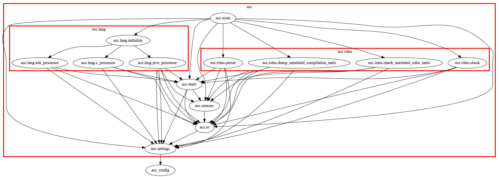

# Contributing

Comments and issues are welcome [here](https://github.com/LionelDraghi/ArchiCheck/issues/new).  
Feel free to suggest whatever improvement.
I'm not a native english speaker. English improvements are welcome, in documentation as in the code.  
Use cases or features suggestions are also welcome.  

# submitting code / docs

To propose some patch          | git command
-------------------------------|-------------------------------------
 1. Fork the project           | fork button on https://github.com/LionelDraghi/ArchiCheck
 2. Clone your own copy        | `git clone https://github.com/your_user_name/ArchiCheck.git`
 3. Create your feature branch | `git checkout -b my-new-feature`    
 4. Commit your changes        | `git commit -am 'Add some feature'` 
 5. Push to the branch         | `git push origin my-new-feature`    
 6. Create new Pull Request    | on your GitHub fork, go to "Compare & pull request".

# Design Overview

Main ArchiCheck components are :

- **ArchiCheck.Main** procedure is the controller, in charge (with separate units) of running operation according to the command line analysis;

- **ArchiCheck.Rules** and child packages defines the rules related types, rules file analisys, rules storage and rules checking. The (to complex) rules file grammar is implemented in Rules.Parser by using the OpenToken lib;

- **ArchiCheck.Lang** defines the abstract language parser interface, and child packages define Ada, Java, etc. implementations. Those packages are in charge of sources analysis to find compilation units dependencies. When a new language processor is added, it shall be registered into Archicheck.Lang.Initialize to be called;

- **ArchiCheck.Settings** defines various application wide constant, and stores various parameters set on command line;

- **ArchiCheck.Units** is an important (and complex) piece of ArchiCheck, definig Unit, Unit attributes, Dependencies, Unit list. It provides services to store Dependencies (typically during sources parsing in Lang child packages), and to retrieve dependencies or analyse relatioship between Units;

- **ArchiCheck.Sources** stores the list of sources found during directories analysis, and defines the location types and services to print this location according to GNU convention;

ArchiCheck was designed to process multiple languages, and AchiCheck vocabulary (Units, Component, Sources, etc.) is as much as possible language agnostic.
Never the less, semantic is different in languages regarding those aspects, and this is an interresting exploration perspective for the ArchiCheck project.  
For example : what is a child unit in C?

Note that in the current version, ArchiCheck rely on OpenToken lib for rules file parsing, and for Ada and Java sources parsing. There is no obligation to do so for other language processor as long as the processor comply with the required abstract interface.

# Tests Overview

The global intent is to have tests documenting the software behavior. Test execution result in a global count of passed/failed/empty tests, and in a text output in Markdown format, integrated in this documentation.

Tests are at exe level, with no unit testing at this stage. To have tests in Makefile behaving like unit test, I created a utility, called `testrec` to record tests execution. 
This utility is build before test execution, and record in a local testrec.md file : comments, test suite start, test start, assertion result, etc.
This is how the test documentation is created, and how I can compile a global tests results (like if it was a single Ada unit test), despite multiple Makefiles and executions.

Tests are defined in Tests subdirs, in (hopfully) coherent subsets.
All tests directories are structured the same way, with Makefiles also structured the same way, and the same naming convention.

Most of the Makefile code aim at documentation production. 

The Makefile himself follow a pattern.
A Test typically documents (order may vary) :

1. When running _this_ command, 
2. with _this_ rules file,
3. and _those_ sources files, or _those_ dependencies between sources (details are not always printed),
4. I should have _this_ result (on standard output, but also on error output, and returned code)

Comments are created in Makefile thanks to `testrec cmt`. They are put in the testrec.md file, not on standard output. 
On standard output, only a line of the form  

> _Test suite name / test name [Successful]_  

is put, to keep Makefile execution clean.

Execution is typically :

1. at the beginning of the Makefile, `testrec create` is called to start a new test suite.
   NB : this is a convention, each Makefile run a single test suite.
2. Then, for each test, `testrec start` is called to start the test (and name it).
3. During the test, `testrec assert` is called at least once, generally to check that the output of archicheck execution is equal to the expected output.
4. Finally, `testrec end` is called. `testrec` will then output the test result on standard output.

The test result may be : 

- _Successul_, if all Assert are verified,
- _Failed_, if at least one is not,
- and _Empty_, if no Assert is called between test start and test end. This is usefull when starting to write a test in the Makefile before code exists : it wouldn't be fair to have those test "Failed".

After all tests execution, `testrec clean` is called to remove the hidden file that stores intermediate results and state, and the `testrec.md` file is moved in the docs directory under a name matching the test suite name, where it will be automatically taken into account.