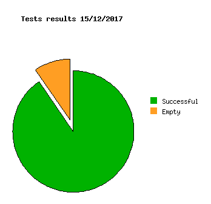

Dashboard
=========

Test results
------------
```
Successful  62
Failed      1
Empty       4
```


Coverage
--------

- Lines coverage rate
```
  lines......: 79.9% (1066 of 1334 lines)
```

- Function coverage rate
```
  functions..: 78.0% (231 of 296 functions)
```

- **Coverage in the sources**
  [lcov generated](http://lionel.draghi.free.fr/Archicheck/lcov/home/lionel/Proj/Archicheck/Src/index-sort-f.html)
