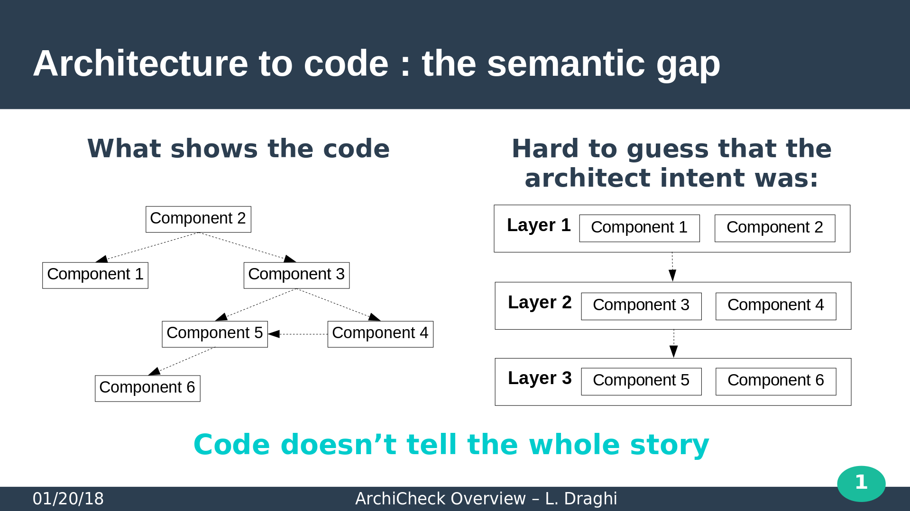
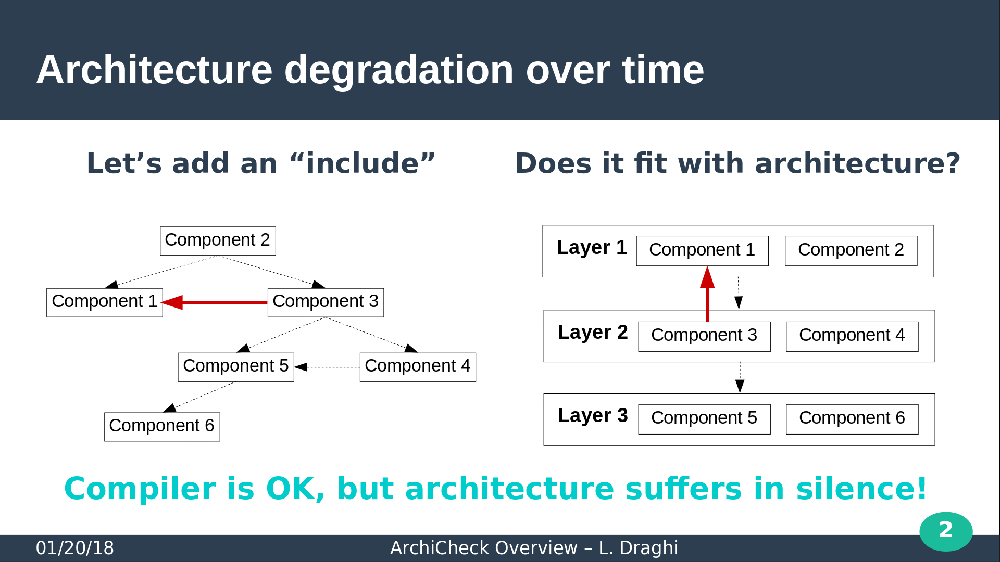

[ArchiCheck](http://lionel.draghi.free.fr/Archicheck/index.html)
================================================================

   [](https://bestpractices.coreinfrastructure.org/projects/1625)

---------------------------------------------------------------------

Overview
--------

Simple structural aspect of the software architecture, metaphore like _My software is a layered system_, can not be fully translated at programming languages level. Even in languages like Ada, powerfull regarding description of the software structure, there is a semantic loss.



Sooner or later, in large or complex developpement, someone will propose a patch adding an `ìmport` that compile fine, but is a complete violation of the architecture.



Archicheck is a simple [free software](copying.md) tool that :

1. ease simple architecture description.  
   > It's really as simple as: _Gtk is a layer over Gdk_.
2. enforce code compliance with that description.  
   > Put archicheck in your test suite, and let it be a vigilant teacher of your architecture over time.

---------------------------------------------------------------------

Get it!
-------

[Source or exe download](building.md)

---------------------------------------------------------------------

Run it!
-------

Archicheck needs :

- a bunch of sources : give the directories with one or more `-I` options;
- an architecture description, called a [`rules file`](rules.md) : a simple text file describing your architecture.

Let's consider the following file `My_Architecture.ac`, that describes a simple layered architecture :

```
Presentation_Layer contains pkg_1, pkg_2
Application_Layer  contains pkg_3, pkg_4

Presentation_Layer is a layer over Application_Layer
```

Run ArchiCheck that way:  
> _archicheck -I src My_Architecture.txt_  

It will check that the code comply with your architecture.

For example, here, it will check that pkg_3 or pkg_4 (in the lower layer) are not using pkg_1 or pkg_2 (in the upper layer).

---------------------------------------------------------------------

Helpful hints
-------------

- `archicheck --create_template` will create a `template.ac` file,
embedding explanations on rules file syntax. 
Rename it and edit it!
- [`archicheck -h` for a complete list of options](cmd_line.md)


---------------------------------------------------------------------

Further readings 
----------------

- [ArchiCheck command line](cmd_line.md)
- [More on rules and rules files](rules.md)
- [More on the project genesis](why.md)
