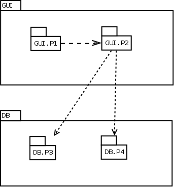
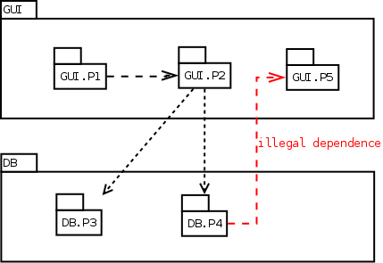
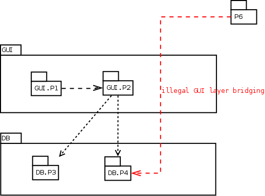
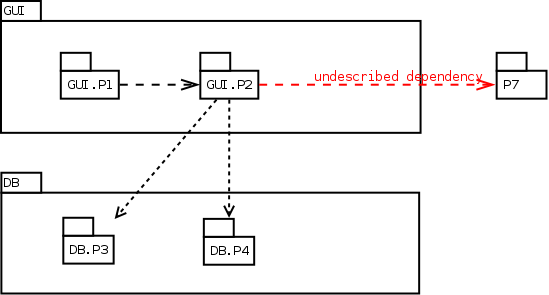

# Child packages test suite


 The tests hereafter are similar to those in [Layer rules tests suite], except that child packages allows to simplify rules file.

 The file rules :

```
 GUI contains P1 and P2
 DB  contains P3 and P4
 GUI is a layer over DB
```

 is simplified in :

```
GUI is a layer over DB
```

 and packages GUI.P1, GUI.P2, DB.P3 and DB.P4 are created.

##  Child packages test suite / Rules OK test, no output expected

  

```
GUI is a layer over DB
```


 Child packages test suite / Rules OK test, no output expected [Successful](tests_status.md#successful)

##  Child packages test suite / Reverse dependency test

  Detection of a dependancy from a lower layer component to an upper layer component.
  

  Expected output :

```
Error : DB.P4 is in DB layer, and so shall not use GUI.P5 in the upper GUI layer
```


 Child packages test suite / Reverse dependency test [Successful](tests_status.md#successful)

##  Child packages test suite / Layer bridging test

  Detection of a dependancy link crossing a layer.
  

  Expected output :

```
Warning : P6 is neither in GUI or DB layer, and so shall not directly use DB.P4 in the DB layer
```


 Child packages test suite / Layer bridging test [Successful](tests_status.md#successful)

##  Child packages test suite / Undescribed dependency test

  Detection of an undescribed dependancy to a component that is neither in the same layer, nor in the lower layer.
  

  Expected output :

```
Warning : GUI.P2 (in GUI layer) uses P7 that is neither in the same layer, nor in the lower DB layer
```


 Child packages test suite / Undescribed dependency test [Successful](tests_status.md#successful)

##  Child packages test suite / Packages in the same layer may with themself


 Child packages test suite / Packages in the same layer may with themself [Successful](tests_status.md#successful)

##  Child packages test suite / GUI.P1 is a GUI child, GUIP1 is not a GUI child pkg


 Child packages test suite / GUI.P1 is a GUI child, GUIP1 is not a GUI child pkg [Successful](tests_status.md#successful)

##  Child packages test suite / Forbidding Interfaces but allowing Interfaces.C


** Child packages test suite / Forbidding Interfaces but allowing Interfaces.C [Failed](tests_status.md#failed)**
