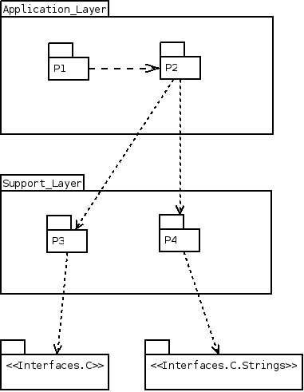
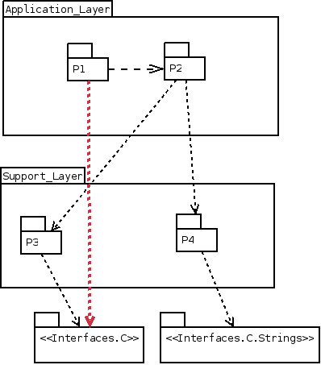

# Globbing Character test suite


##  Globbing Character test suite / rules test


  Testing this dependencies :  

    

  against this rules file :  

```  
Application_Layer contains P1, P2
Support_Layer contains P3, P4
only Support_Layer may use Interfaces.*
```  

  No expected output (no error)  

Globbing Character test suite / rules test [Empty](tests_status.md#empty)

##  Globbing Character test suite / illegal use of Interfaces from Application_Layer


  Testing this dependencies :  

    

  against this rules file :  

```  
Application_Layer contains P1, P2
Support_Layer contains P3, P4
only Support_Layer may use Interfaces.*
```  

  Expected output :  

```  
Error : P1 is not in Support_Layer layer, and so shall not use Interfaces.* packages
```  

Globbing Character test suite / illegal use of Interfaces from Application_Layer [Empty](tests_status.md#empty)
