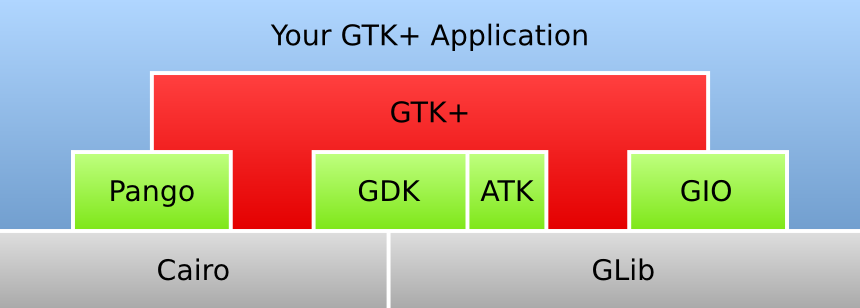

# GtkAda test suite


##  GtkAda test suite / File Identification

  Checking that

  > archicheck -q -lf -r -I gtkada-master

  is identifying the same files (once sorted) than

  > find gtkada-master -name *.ad[sb]


 GtkAda test suite / File Identification [Successful](tests_status.md#successful)

##  GtkAda test suite / Unit Identification


  > archicheck -ld -r -I gtkada-master

  4785 unit found, not detailed here

 GtkAda test suite / Unit Identification [Successful](tests_status.md#successful)

##  GtkAda test suite / A realistic GtkAda description file


  

  Checking those rules over GtkAda:

```
Interfaces use is allowed
System     use is allowed 
Ada        use is allowed
GNAT       use is allowed

Pango may use Cairo
Pango may use Glib

Gdk may use Cairo

GtkAda may use Gtk 

Gtk may use Glib
Gtk may use Pango
Gtk may use Gdk
Gtk may use Cairo

-- Exceptions to previous declarations
GtkAda.Bindings use is allowed
GtkAda.Types    use is allowed
GtkAda.C        use is allowed
Gtk.Arguments   use is allowed -- This package is obsolete and replaced by Glib.Values
```

  Expected output:

```
Error : Gtk is over Gdk, so Gdk.Dnd shall not use Gtk
Error : Gtk is over Gdk, so Gdk.Dnd shall not use Gtk.Target_List
Error : Gtk is over Gdk, so Gdk.Dnd shall not use Gtk
Error : GtkAda is over Gtk, so Gtk.GLArea shall not use Gtkada.Handlers
```


 GtkAda test suite / A realistic GtkAda description file [Successful](tests_status.md#successful)

##  GtkAda test suite / Another realistic GtkAda description file


  

  Checking those rules over GtkAda:

```
Interfaces use is allowed
System     use is allowed 
Ada        use is allowed
GNAT       use is allowed

-- Pango may use Cairo
-- Pango may use Glib
-- Gdk   may use Cairo
Low_Level contains Cairo and Glib -- arbitrary name
Utilities contains Pango, Gdk     -- arbitrary name
Utilities is a layer over Low_Level
Gtk is a layer over Utilities


GtkAda may use Gtk 

-- Gtk may use Glib
-- Gtk may use Pango
-- Gtk may use Gdk
-- Gtk may use Cairo
Gtk may use Low_Level
Gtk may use Utilities
GtkAda may use Low_Level
GtkAda may use Utilities

-- Exceptions to previous declarations
GtkAda.Bindings use is allowed
GtkAda.Types    use is allowed
GtkAda.C        use is allowed
Gtk.Arguments   use is allowed -- This package is obsolete and replaced by Glib.Values
```

  Expected output:

```
Error : Gtk is over Gdk, so Gdk.Dnd shall not use Gtk
Error : Gtk is over Gdk, so Gdk.Dnd shall not use Gtk.Target_List
Error : Gtk is over Gdk, so Gdk.Dnd shall not use Gtk
Error : GtkAda is over Gtk, so Gtk.GLArea shall not use Gtkada.Handlers
```


** GtkAda test suite / Another realistic GtkAda description file [Failed](tests_status.md#failed)**
