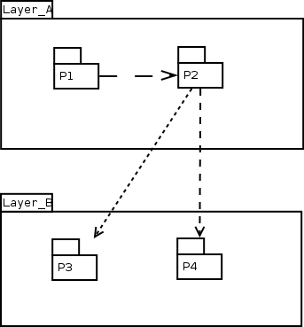
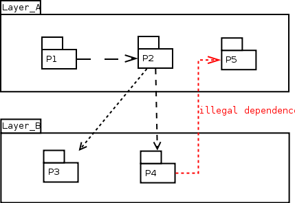
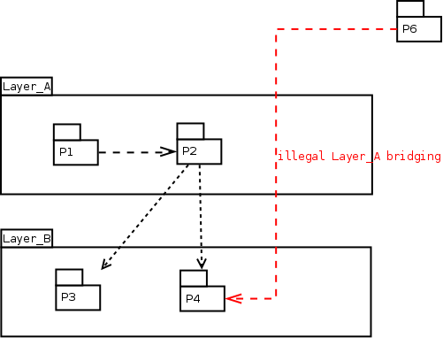
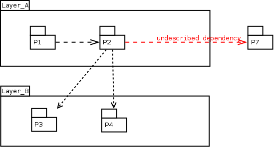

# Layer rules test suite


##  Layer rules test suite / Code is compliant with rules file, no output expected


  

```
Layer_A contains P1, P2
Layer_B contains P3, P4
Layer_A is a layer over Layer_B
```


 Layer rules test suite / Code is compliant with rules file, no output expected [Successful](tests_status.md#successful)

##  Layer rules test suite / Batik project architecture, code is compliant with rules file, no output expected

  Architecture of the The Apache Batik Project, available <here at https://xmlgraphics.apache.org/batik/using/architecture.html>.

  

  Described by this rules file :

```
Applications      contains Browser and Rasterizer
Core_Modules      contains UI_Component, Transcoder, SVG_Generator, Bridge and SVGDOM
Low_Level_Modules contains Renderer, GVT and SVG_Parser

Applications is a layer over Core_Modules
Core_Modules is a layer over Low_Level_Modules
```


 Layer rules test suite / Batik project architecture, code is compliant with rules file, no output expected [Successful](tests_status.md#successful)

##  Layer rules test suite / Reverse dependency test

  Detection of a dependancy from a lower layer component to an upper layer component.

  

```
Layer_A contains P1, P2, P5
Layer_B contains P3, P4
Layer_A is a layer over Layer_B
```

  Expected output :

```
Error : P4 is in Layer_B layer, and so shall not use P5 in the upper Layer_A layer
```


 Layer rules test suite / Reverse dependency test [Successful](tests_status.md#successful)

##  Layer rules test suite / Layer bridging test

  Detection of a dependancy link crossing a layer.

  

```
Layer_A contains P1, P2
Layer_B contains P3, P4
Layer_A is a layer over Layer_B
```

  Expected output :

```
Warning : P6 is neither in Layer_A or Layer_B layer, and so shall not directly use P4 in the Layer_B layer
```


 Layer rules test suite / Layer bridging test [Successful](tests_status.md#successful)

##  Layer rules test suite / Using a package that is neither in the same layer, nor in the visible layer

  Detection of an undescribed dependancy to a component that is neither in the same layer, nor in the lower layer.

  

```
Layer_A contains P1, P2
Layer_B contains P3, P4
Layer_A is a layer over Layer_B
```

  Expected output :

```
Warning : P2 (in Layer_A layer) uses P7 that is neither in the same layer, nor in the lower Layer_B layer
```


 Layer rules test suite / Using a package that is neither in the same layer, nor in the visible layer [Successful](tests_status.md#successful)
