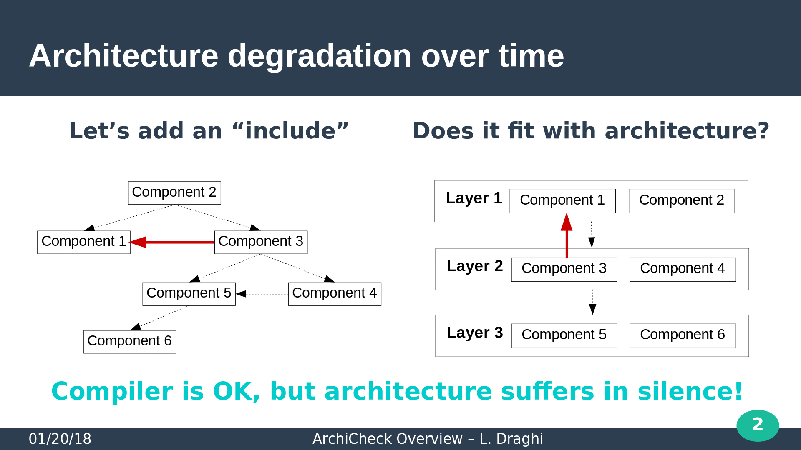

# Why ArchiCheck?

The idea of ArchiCheck arose during my experience as software achitect on a large software product line.  
I was frustrated that simple architecture and design decision where not followed : no matter how clever was the design or the use of the coding language, sooner or later someone was adding a quick and dirty "import" of a compilation unit to easily fix a bug, that was a clear violation of the architecture.  

It was not detected a compile time, and sometimes resulted in hard to detect subtle behavior changes, or elaboration order problems.  
And, at least, in progressive code spaghettization.

The obvious solution to this architecture and code degradation was to add the missing semantic.  
But where?

- At design level, using an ADL, in modelling tool or UML extension?
- At the code level, with an external tool like ArchiCheck, in special comments needing a preprocessor, directly in future programming languages?

But there is not always a model, and even if so, the code is rarely generated from the model.
On the other hand, there is always code, and most of the semantic is already in the code.  

> So, the first decision was to stay at code level.  

Because I wanted something simple, that don't interfer with existing tools, decision was made :  

> To define a syntax to describe a software architecture in terms of partition and dependencies, in a file independent of sources, and a tool that checks the conformance of sources with this description.

Sometimes a picture is worth a thousand words, sometimes not.  
An architecture diagram hardly beat a simple metaphor.

[illustration TBD]

So, let's keep it simple to use and to understand : no uggly XML or specific cryptic format, no need to use shell scripting or programming language, no "X -> Y" that could be interpreted in many ways, and no graphic tool : just a simple and natural english syntax.

> For the syntax, it was decided to stick with common architecture Metaphors, like :  
>
> - _Gtk is a layer over Gdk_
>
> or architecture decisions / elements of architecture, like :
>
> - _only *\_Component may use Component_Framework_
> - _OS_Lib use allowed only in Hardware_Abstraction_Layer_

And, final decisions for architect peace of mind :  

> The tool will aim at being inserted in the test suite (return status > 0 if some rule is broken), and continuously enforces code coherency with your design;

> The tool will play an architecture teaching role, by providing clear error messages refering to the faulty code, and to the violated rules. 

(Am I a lazzy architect? maybe... :-).

